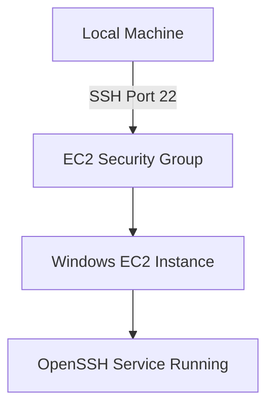

## 🚀 Setting Up and Managing a Windows EC2 Instance with VS Code Remote SSH

Running a Windows EC2 machine on AWS can give you the flexibility of cloud resources while retaining the familiarity of the Windows environment. This guide will walk you through setting up VS Code Remote SSH, configuring security, and automating routine tasks like scheduled shutdowns.

### 🔑 Step 1: Install and Configure OpenSSH on Windows EC2

After connecting via RDP into your Windows EC2 instance:

```powershell
Add-WindowsCapability -Online -Name OpenSSH.Server~~~~0.0.1.0
Start-Service sshd
Set-Service -Name sshd -StartupType 'Automatic'
Get-NetFirewallRule -Name *ssh*
New-NetFirewallRule -Name sshd -DisplayName 'OpenSSH Server (sshd)' -Enabled True -Direction Inbound -Protocol TCP -Action Allow -LocalPort 22
Get-Service sshd
```

✅ This enables SSH access into your Windows EC2 machine.

📌 Tip: If you want to save system resources later, you can stop the SSH service using:

```powershell
Stop-Service sshd
Get-Service sshd
```

### 🌐 Step 2: Configure AWS Security Group for SSH Access

1. Go to your EC2 Dashboard → Select your instance.
2. Under the Security tab, click the Security Group ID.
3. Add a new Inbound Rule:
   * Type: SSH
   * Protocol: TCP
   * Port Range: 22
   * Source: Anywhere (IPv4)

Restart the instance once to be safe.



### 💻 Step 3: Set Up Local SSH Config on Mac

On your local machine (MacOS), edit your \~/.ssh/config file:  

```
Host win-ec2
  HostName ec2-public_ipv4_address.ap-south-1.compute.amazonaws.com
  User Administrator
  IdentityFile /Users/username/Downloads/ec2_key.pem

```

Also update permissions for the key file:  
